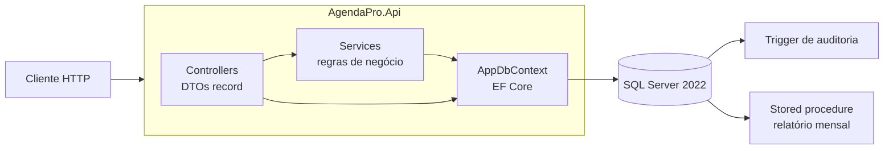
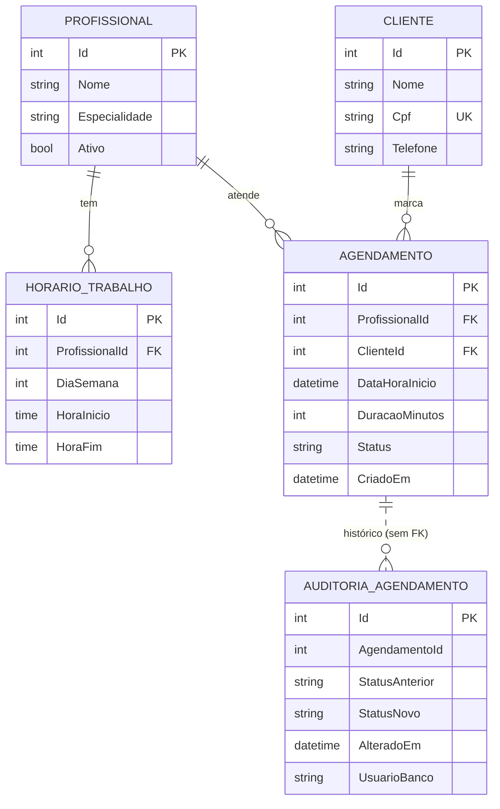

# AgendaPro

[](https://github.com/elvertoni/agenda-pro/actions/workflows/ci.yml)

API de agendamento de profissionais (clínicas, consultórios, salões). Um cliente marca um horário com um profissional; a API garante que o horário esteja dentro do expediente, no futuro e **sem conflito** com outro agendamento, mesmo com várias requisições simultâneas.

Projeto de portfólio feito para estudar e demonstrar o dia a dia de uma API em **C# / .NET**: regras de negócio testadas, banco relacional de verdade (SQL Server com trigger e stored procedure), índice medido, Docker e CI.

## Tecnologias

| Camada | Tecnologia |
|---|---|
| Linguagem / runtime | C# 14, **.NET 10** (LTS) |
| Web | ASP.NET Core Web API com controllers, OpenAPI nativo e Scalar (`/scalar/v1`, só em Development) |
| Dados | Entity Framework Core 10, **SQL Server 2022** |
| Testes | xUnit, `WebApplicationFactory` (integração contra SQL Server real) |
| Infra | Docker (multi-stage, usuário não-root), Docker Compose, GitHub Actions |

## Arquitetura



- **Controllers finos** recebem e devolvem **DTOs** (`record`); nenhuma entidade sai pela API.
- **`AgendamentoService`** concentra as regras de agendamento. A lógica pura (sobreposição de intervalos, expediente, horários livres) fica em funções estáticas sem banco (`Intervalos`, `RegrasAgendamento`), por isso é testada com testes unitários rápidos.
- **O banco faz o que o banco faz melhor:** índice para a consulta de conflito, trigger para auditar mudanças de status e stored procedure para o relatório.

## Modelo de dados



Índices: `Cliente.Cpf` único e `Agendamento (ProfissionalId, DataHoraInicio)` composto.

## Como rodar

### Com Docker (recomendado)

Precisa só do Docker Desktop.

```powershell
Copy-Item .env.example .env      # edite o .env e troque a senha (a MESMA nas duas linhas)
docker compose up --build -d
Invoke-RestMethod http://localhost:8080/health   # Healthy
```

O compose sobe três serviços, em ordem:

1. **`db`**: SQL Server 2022 (porta **1434** no PC, volume `agendapro-dados`), com healthcheck.
2. **`migrator`**: aplica as migrations (`efbundle`) e termina.
3. **`api`**: só inicia depois que as migrations terminaram. Escuta em `http://localhost:8080` (ambiente Production: sem Scalar).

Para parar sem apagar os dados: `docker compose stop`. Para apagar também o banco: `docker compose down -v`.

### Local (para desenvolver e depurar)

Precisa do .NET 10 SDK, de um SQL Server (por exemplo, `docker run` da imagem `mcr.microsoft.com/mssql/server:2022-latest`) e da ferramenta `dotnet-ef`.

```powershell
# A connection string fica nos user-secrets, nunca em arquivo versionado.
dotnet user-secrets set "ConnectionStrings:Default" "Server=localhost,1433;Database=AgendaPro;User Id=sa;Password=<sua senha>;TrustServerCertificate=True" --project AgendaPro.Api

dotnet ef database update --project AgendaPro.Api --startup-project AgendaPro.Api
dotnet run --project AgendaPro.Api
```

O `dotnet run` mostra a porta em `Now listening on`. Em Development, a documentação interativa (Scalar) está em `/scalar/v1`.

### Testes

Os testes de integração usam um banco **separado**, `AgendaPro_Tests`, apagado e recriado a cada execução (a fábrica de testes recusa qualquer outro nome de banco).

```powershell
dotnet user-secrets set "ConnectionStrings:Tests" "Server=localhost,1433;Database=AgendaPro_Tests;User Id=sa;Password=<sua senha>;TrustServerCertificate=True" --project AgendaPro.Tests
dotnet test
```

Hoje são **147 testes** (unitários e de integração). No CI, a connection string vem da variável `ConnectionStrings__Tests`.

## Endpoints

Erros de regra de negócio e de validação voltam como **ProblemDetails** (RFC 9457), com o status certo.

| Método | Rota | O que faz | Erros |
|---|---|---|---|
| GET | `/health` | Saúde da API e do banco (200 `Healthy` / 503 `Unhealthy`) | |
| GET | `/api/profissionais?especialidade=&ativo=` | Lista profissionais (filtros opcionais) | |
| GET | `/api/profissionais/{id}` | Detalha um profissional | 404 |
| POST | `/api/profissionais` | Cadastra profissional | 400 |
| PUT | `/api/profissionais/{id}` | Atualiza nome e especialidade | 400, 404 |
| PATCH | `/api/profissionais/{id}/ativo` | Ativa ou inativa | 400, 404 |
| GET | `/api/profissionais/{id}/horarios` | Lista o expediente | 404 |
| POST | `/api/profissionais/{id}/horarios` | Cria um bloco de expediente | 400 (fim ≤ início), 404, 409 (sobreposto) |
| DELETE | `/api/profissionais/{id}/horarios/{horarioId}` | Remove um bloco | 404 |
| GET | `/api/profissionais/{id}/disponibilidade?data=&duracaoMinutos=` | Horários livres no dia | 400 (sem data, inativo), 404 |
| GET | `/api/clientes?nome=` | Lista clientes, com filtro opcional por nome (CPF mascarado) | |
| GET | `/api/clientes/{id}` | Detalha um cliente | 404 |
| POST | `/api/clientes` | Cadastra cliente | 400 (CPF inválido), 409 (CPF duplicado) |
| PUT | `/api/clientes/{id}` | Atualiza nome e telefone (o CPF não muda) | 400, 404 |
| POST | `/api/agendamentos` | Cria agendamento | 400, 404, 409 |
| GET | `/api/agendamentos?profissionalId=&data=&status=` | Lista com filtros | |
| GET | `/api/agendamentos/{id}` | Detalha um agendamento | 404 |
| GET | `/api/agendamentos/{id}/auditoria` | Histórico de mudanças de status | 404 |
| PATCH | `/api/agendamentos/{id}/cancelar` | Cancela (só se Agendado) | 404, 409 |
| PATCH | `/api/agendamentos/{id}/concluir` | Conclui (só se Agendado) | 404, 409 |
| GET | `/api/relatorios/atendimentos?ano=&mes=` | Atendimentos por profissional no mês (stored procedure) | 400 |

Exemplo, criando um agendamento:

```http
POST /api/agendamentos
Content-Type: application/json

{ "profissionalId": 1, "clienteId": 1, "dataHoraInicio": "2026-10-12T09:00:00", "duracaoMinutos": 30 }
```

## Regras de negócio

Ao criar um agendamento, a API valida nesta ordem:

1. Profissional e cliente existem (404) e o profissional está **ativo** (400).
2. O horário **não está no passado** (400).
3. O agendamento **cabe inteiro** em um bloco de expediente do dia da semana (400).
4. **Não há conflito** com outro agendamento do mesmo profissional (409). Agendamentos cancelados não contam.

Outras regras:

- Cancelar e concluir só valem para agendamento com status `Agendado` (senão, 409).
- CPF é validado (dígitos verificadores) e único. Em toda resposta ele sai **mascarado** (`***.456.789-**`) e nunca vai para o log.
- Duração do agendamento: de 10 a 240 minutos. Nenhum agendamento atravessa a meia-noite.
- Datas de agendamento são o horário local da clínica (`DateTime` sem fuso); `CriadoEm` é UTC. O "agora" vem de um `TimeProvider` injetado, o que permite fixar o relógio nos testes.

## Decisões técnicas

- **DTOs `record` na entrada e na saída.** A entidade é o formato do banco; o DTO é o contrato da API. Misturar os dois exporia campos internos (como o CPF completo) e travaria mudanças no banco.
- **Tudo assíncrono** (`async/await`, `ToListAsync`, `SaveChangesAsync`): a thread volta ao pool enquanto o banco responde, e a API atende mais requisições com menos threads. Leituras usam `AsNoTracking()` e `Select` direto para o DTO.
- **Índice composto `(ProfissionalId, DataHoraInicio)`.** A consulta mais frequente é "os agendamentos deste profissional neste dia". Medido com 200 mil agendamentos: de um `Clustered Index Scan` com 1.913 leituras para um `Index Seek` com 35 (cerca de 55 vezes menos). Detalhes e a metodologia em [`docs/PERFORMANCE.md`](docs/PERFORMANCE.md).
- **Trigger de auditoria.** O histórico de mudanças de status é gravado pelo **banco**, no mesmo comando do `UPDATE`. Assim ele vale para qualquer origem da alteração (API, script, outro sistema) e não pode ser esquecido por um desenvolvedor. O trigger é *set-based* (trata várias linhas de uma vez). A tabela de auditoria não tem chave estrangeira de propósito, para o histórico sobreviver ao agendamento.
- **Stored procedure para o relatório.** A agregação (contar atendimentos por profissional no mês) acontece perto dos dados. A chamada usa string interpolada do EF, que vira **parâmetros SQL** (sem risco de SQL injection).
- **Migrations em um serviço `migrator`**, e não no startup da API. Com várias instâncias, todas tentariam migrar ao mesmo tempo; a API precisaria de permissão para alterar o esquema; e uma migration com erro derrubaria a subida de um jeito difícil de enxergar. Localmente, `dotnet ef database update`.
- **CORS fechado por padrão**, com as origens em `Cors:Origins`. Por padrão só o front em `http://localhost:4200` é liberado.
- **Erros padronizados.** Tudo que dá errado (inclusive 404 de rota inexistente e 405) sai como ProblemDetails; exceções não tratadas viram 500 genérico, sem vazar detalhes.
- **Segredos fora do Git.** A connection string de desenvolvimento fica nos user-secrets; no Docker, vem do `.env` (ignorado pelo Git), com um `.env.example` de modelo.

## Concorrência: o que está protegido e o que não está

**Protegido:** duas requisições simultâneas para o mesmo profissional e o mesmo horário. "Checar conflito" e "gravar" são dois passos; sem proteção, os dois pedidos passariam juntos pela checagem. A solução é uma transação que **trava a linha do profissional** (`UPDLOCK`) antes de checar: quem disputa o mesmo profissional entra numa fila, relê os agendamentos já confirmados e recebe 409. Profissionais diferentes não se bloqueiam. Há um teste que dispara 12 requisições simultâneas e confere que só uma é criada. Escolhido no lugar do nível `Serializable`, que trava intervalos de índice e pode gerar deadlock.

**Não protegido (limitação conhecida):** a regra de **sobreposição de blocos de expediente** (`POST .../horarios`) é checada na aplicação e não tem trava nem restrição no banco; duas requisições simultâneas poderiam criar blocos sobrepostos. É um risco baixo (cadastro de expediente é raro e feito por poucas pessoas) e foi aceito de propósito. Para fechar essa janela, o caminho seria a mesma trava de linha do profissional.

## Estrutura do repositório

```
agenda-pro/
├── AgendaPro.Api/          Controllers, Services, Data, Dtos, Models, Validation, Migrations, Dockerfile
├── AgendaPro.Tests/        Testes unitários e de integração (xUnit)
├── docs/                   PERFORMANCE.md, PERGUNTAS_ENTREVISTA.md e scripts SQL (seed e medição)
├── .github/workflows/      ci.yml
├── docker-compose.yml
└── .env.example
```

## Documentação adicional

- [`docs/PERFORMANCE.md`](docs/PERFORMANCE.md): medição do índice com 200 mil agendamentos.
- [`docs/PERGUNTAS_ENTREVISTA.md`](docs/PERGUNTAS_ENTREVISTA.md): perguntas de entrevista de cada fase, com respostas.

## Próximos passos

- Front-end em **Angular** consumindo esta API (o CORS já está pronto para `http://localhost:4200`).
- Autenticação e autorização (JWT), hoje inexistentes: a API é aberta.
- Paginação nas listagens.
- Fechar a janela de concorrência dos horários de expediente.
